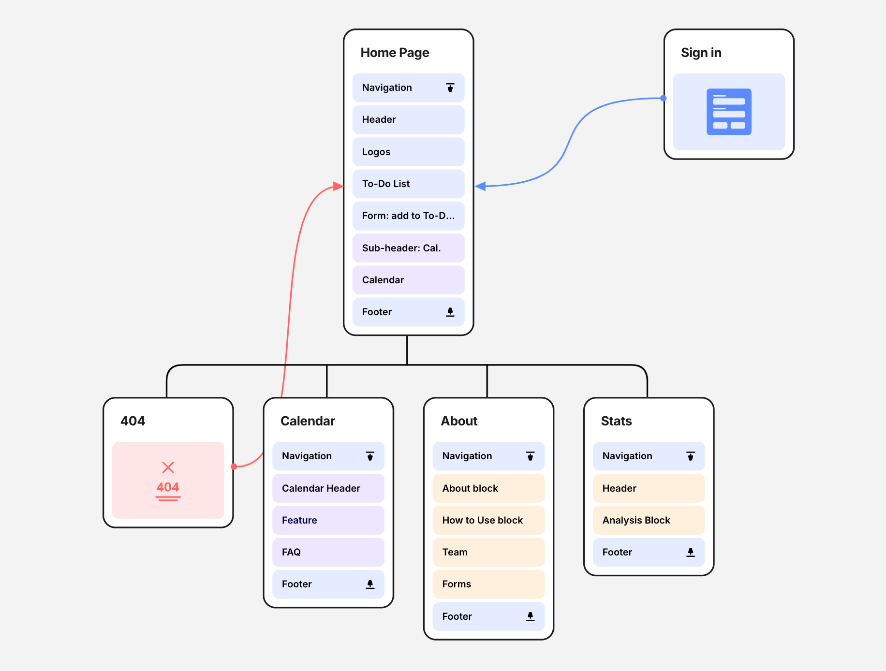

# Journey Tasks - Sophia Chan Capstone Project
## Table of Contents
1. [Overview](##Overview)
    - [Problem Space](###problem-space)
    - [User Profile](###user-profile)

## Overview

JourneyTask is a task management app that combines time planning with your to-do list. Unlike regular to-do lists, JourneyTask allows you to assign time estimates for tasks and seamlessly add them to your calendar. The app emphasizes the importance of the process over the outcome, highlighting that every step is part of the journey.

### Problem Space
Have you ever struggled with balancing to-do lists and calendars?

Regular apps either focus on lists without accounting for the time required to complete tasks or on calendars without flexibility of task management.
- When you make a to-do list there is either an extra step to go from the to-do list to the calendar.
- Or if you only use calendar without to-do list, this does not account for completion of task.
- Example of others having this [problem](https://answers.microsoft.com/en-us/msoffice/forum/all/how-can-i-integrate-the-to-do-tasks-into-the/9ba1819a-40e6-42da-9805-8f99a3cb0deb)

JouneyTaks address this by helping users organize tasks wihtin the context of their busy schedules, avoiding task overload while accounting for both meetings and personal tasks.

### User Profile

JourneyTasks is for:
- A user that wants to make a to-do lists but have it accessible from any device connected to the internet.
- A user who juggles multiple responsibilities and needs help managing time-based tasks.
- A user who needs help balancing school work, assignments, extracurriculars, and study time.
- A user who needs to coordinate family activities, personal tasks, and work commitments.
- A neurodiverse user who needs flexible scheduling and better task organization.

### Features

List the functionality that your app will include. These can be written as user stories or descriptions with related details. Do not describe _how_ these features are implemented, only _what_ needs to be implemented.
- As a user I want to be able to...

## Implementation
1. Basic components
    - Routes
2. Create Database
    - login/users (nice to have)
    - Goal (nice to have)
    - To Do List (MVP: id, user_id, task_name, start date, duration, end date, status )
    - Calendar?

3. Import Calendar APIs
    - Google Calendar (MVP)
    - Outlook

4. Create Express Server to save, read, delete to do list

5. Accessibility pop up
    - Theme
    - Customize font size (toggle between small, medium, large)
    - Font family switch to dyslexia
    - Contrast view (black with neon font)
    - accessible button moves anywhere on the screen

### Tech Stack

List technologies that will be used in your app, including any libraries to save time or provide more functionality. Be sure to research any potential limitations.

- client libraries
    - react
    - react-router-dom
    - axios
    - react-google-calendar
    - react-week-calendar
    - react-calendar
    - tailwindscss

- servers libraries
    - knex
    - express
    - bycrypt for password hashing

### APIs

#### Google Calendar API
| End Point   | Description              |
| :-------- | :------------------------- |
|Get| this end point is for getting the calendar events of a user|

#### Outlook Calendar API
| End Point   | Description              |
| :-------- | :------------------------- |
|Get| this end point is for getting the calendar events of a user|

### Sitemap

List the pages of your app with brief descriptions. You can show this visually, or write it out.

Home page

### Mockups

Provide visuals of your app's screens. You can use pictures of hand-drawn sketches, or wireframing tools like Figma.

### Data

Describe your data and the relationships between the data points. You can show this visually using diagrams, or write it out.

### Endpoints

List endpoints that your server will implement, including HTTP methods, parameters, and example responses.

## Roadmap

Scope your project as a sprint. Break down the tasks that will need to be completed and map out timeframes for implementation working back from the capstone due date.

---

## Future Implementations
Your project will be marked based on what you committed to in the above document. Here, you can list any additional features you may complete after the MVP of your application is built, or if you have extra time before the Capstone due date.

- Additional pages/widgest
    - weather
    - pomodor timer
    - sorting to do list based on Eisenhower Matrix (Urgent/Important, Not Urgent/important, Urgent/Unimportant, Not Urgent/Unimportant)
    - Goals/ sub items/bigger goal relationships so that this can be used to visualize the journey to completing goals/large tasks
    - Accesibilty toggle add-ons:
        - Customize colors to user preference
        - Blidness
        - Visually impaired
        - motor skill disorders
        - colour blindness
        - Epilepsy
        - ADHD
        - Learning
        - Elder

    - Utilize AI to help reschedule tasks to the next open slot - would need to shift all other tasks
-   Energy tracker/data tracker of what you do ~ helps improve efficency when you know what time of day you have more/less energy
- Provide suggestions on duration based on past feedback about how long tasks have taken to complete.
- Eventually this could be used by employers to better understand where bottlenecks are or where their employees are getting bogged down (such as meetings)
- Categories for to do list
- Filter feature to filter only tasks for a day, week, month, or category
- Nodemailer for email notifications of daily task summaries

#### OpenAI API for future AI scheduling
| End Point   | Description              |
| :--------   | :------------------------- |
|coming soon  | this end point is for getting the calendar events of a user|
