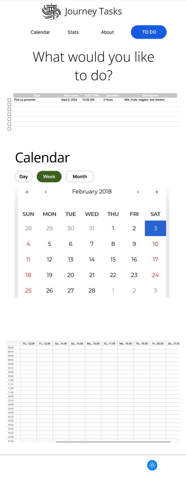
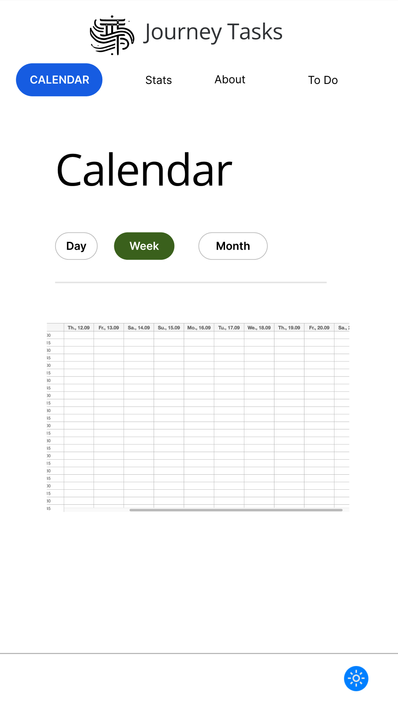
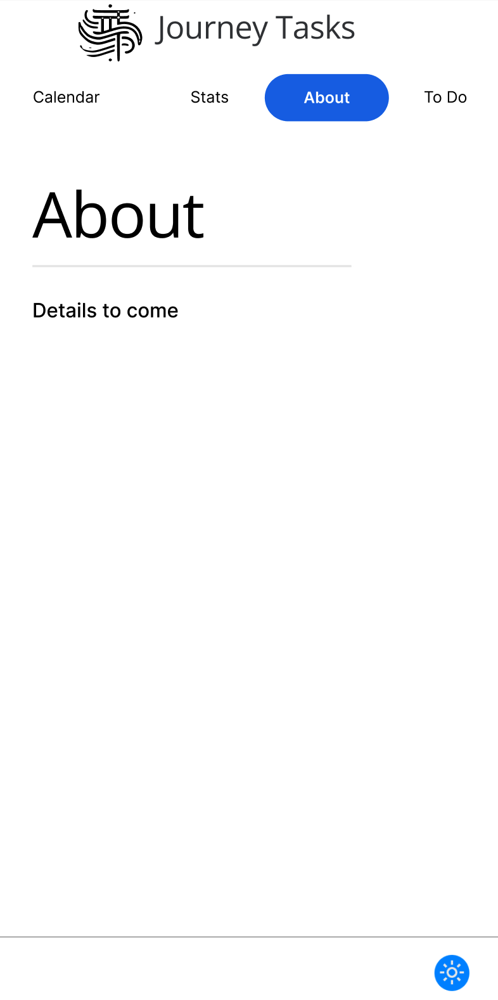
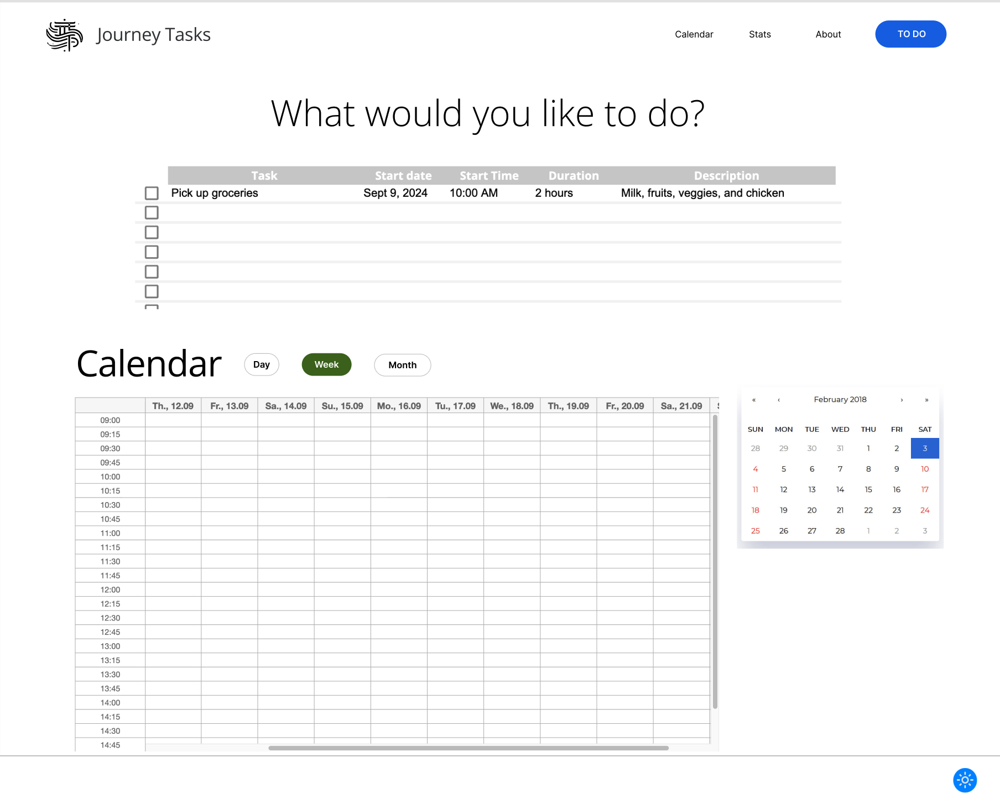
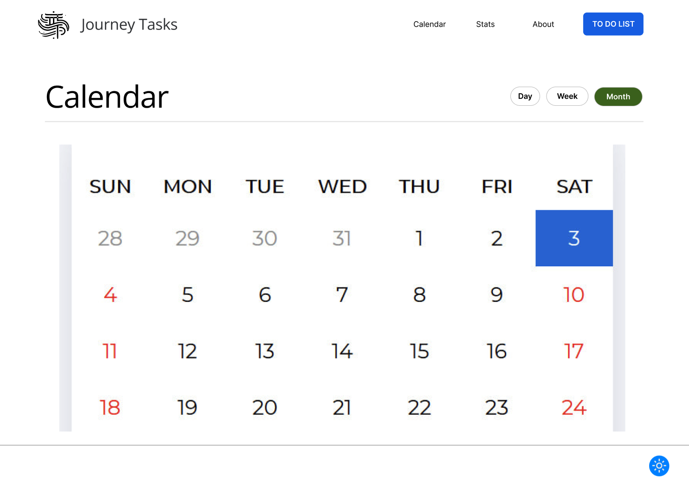
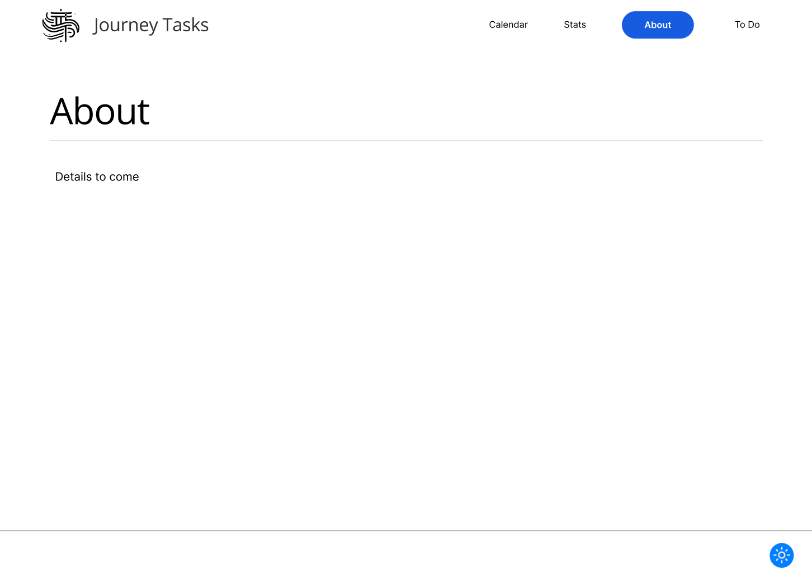

#  JourneyTask - Sophia Chan Capstone Project
## Table of Contents
1. [Overview](#overview)
    - [Problem Space](#problem-space)
    - [User Profile](#user-profile)
    - [Features](#features)

2. [Implementation](#implementation)
    - [Tech Stack](#tech-stack)
    - [APIs](#apis)
        - [Google Calendar API](#google-calendar-api)
        - [Outlook Calendar API](#outlook-calendar-api)
    - [Sitemap](#sitemap)
    - [Mockups](#mockups)
    - [Data](#data)
    - [Endpoints](#endpoints)
3. [Roadmap](#roadmap)
4. [Future Implementations](#future-implementations)

## Overview

JourneyTask is a task management app that combines time planning with your to-do list. Unlike regular to-do lists, JourneyTask allows you to assign time estimates for tasks and seamlessly add them to your calendar. The app emphasizes the importance of the process over the outcome, highlighting that every step is part of the journey.


### Problem Space
Have you ever struggled with balancing to-do lists and calendars?

Regular apps either focus on lists without accounting for the time required to complete tasks or on calendars without flexibility of task management.
- When you make a to-do list there is either an extra step to go from the to-do list to the calendar.
- Or if you only use calendar without to-do list, this does not account for completion of task.
- Example of others having this [problem](https://answers.microsoft.com/en-us/msoffice/forum/all/how-can-i-integrate-the-to-do-tasks-into-the/9ba1819a-40e6-42da-9805-8f99a3cb0deb)

JouneyTaks address this by helping users organize tasks wihtin the context of their busy schedules, avoiding task overload while accounting for both meetings and personal tasks.

### User Profile

JourneyTask is for:
- A user that wants to make a to-do lists but have it accessible from any device connected to the internet.
- A user who juggles multiple responsibilities and needs help managing time-based tasks.
- A user who needs help balancing school work, assignments, extracurriculars, and study time.
- A user who needs to coordinate family activities, personal tasks, and work commitments.
- A neurodiverse user who needs flexible scheduling and better task organization.

### Features

List the functionality that your app will include. These can be written as user stories or descriptions with related details. Do not describe _how_ these features are implemented, only _what_ needs to be implemented.
- As a user I want to be able to...

## Implementation
1. Basic components
    - Routes
2. Create Database
    - login/users (nice to have)
    - Goal (nice to have)
    - To Do List (MVP: id, user_id, task_name, start date, duration, end date, status )
    - Calendar?

3. Import Calendar APIs
    - Google Calendar (MVP)
    - Outlook

4. Create Express Server to save, read, delete to do list

5. Accessibility pop up
    - Theme
    - Customize font size (toggle between small, medium, large)
    - Font family switch to dyslexia
    - Contrast view (black with neon font)
    - accessible button moves anywhere on the screen


### Tech Stack

List technologies that will be used in your app, including any libraries to save time or provide more functionality. Be sure to research any potential limitations.

The front end will be build using React.
- Client libraries used are:
    - <a href="https://reactjs.org/" target="_blank" rel="noreferrer">  </a>
    - [react-router-dom](https://www.npmjs.com/package/react-router-dom) which uses [react-router](https://www.npmjs.com/package/react-router)
    - [axios](https://www.npmjs.com/package/axios
    )
    - [react-google-calendar](https://www.npmjs.com/package/react-google-calendar-api)
    - [react-week-calendar](https://www.npmjs.com/package/react-week-calendar)
    - [react-calendar](https://www.npmjs.com/package/react-calendar)
    - tailwindscss <a href="https://tailwindcss.com/" target="_blank" rel="noreferrer">  </a>

- servers libraries
    - [knex](https://www.npmjs.com/package/knex)
    - express <a href="https://expressjs.com" target="_blank" rel="noreferrer">  </a>
    - node.js<a href="https://nodejs.org" target="_blank" rel="noreferrer">  </a>
    - Future Implementation: [bycrypt for password hashing](https://www.npmjs.com/package/bookshelf-bcryptjs)

### APIs

#### Google Calendar API
| End Point   | Description              |
| :-------- | :------------------------- |
|Get| this end point is for getting the calendar events of a user|


#### Outlook Calendar API
| End Point   | Description              |
| :-------- | :------------------------- |
|Get| this end point is for getting the calendar events of a user|

### Sitemap


- Home page displays the to-do list component and the user's calendar.
    - to-do list component includes the user's task list with options to click to edit delete or mark complete.
- Calendar page shows the calendar day/week/month view to schedule tasks
- Stats page is part of the future implementation which will include completed tasks, larger goals and the journey diagram to see where tasks are in comparison to large goals and projects
- About page includes information for the user how to use JourneyTasks, information tips about how to be more productive and the idea about JourneyTasks.

### Mockups
The site will be built using a mobile first approach:

| Mobile Home Page  | Mobile Calendar Page | Mobile About Page     |
| :--------  | :-------- |  :-------- |
|  |   | |

Then desktop will be designed:

| Tablet/Desktop Home Page  | Tablet/Desktop Calendar Page | Tablet/Desktop About Page     |
| :--------  | :-------- |  :-------- |
|  |   | |

### Data

Describe your data and the relationships between the data points. You can show this visually using diagrams, or write it out.
- users
- tasks
- calendar events
- task stats

### Endpoints
List endpoints that your server will implement, including HTTP methods, parameters, and example responses.
#### Get all tasks

```http
  GET /tasks
```

| Parameter | Type | Description    |
| :--------  | :-------- |  :------------------------ |
| `api_key` | `string` |  **Required** Your API key |

#### Adds a new task

```http
  POST /tasks
```

| Parameter | Type | Description    |
| :--------  | :-------- |  :------------------------ |
| `api_key` | `string` |  **Required** Your API key |
#### Edits a task

```http
  PUT /tasks/:id
```

| Parameter | Type | Description    |
| :--------  | :-------- |  :------------------------ |
| `id` | `number` |  **Required** Id of a task is needed to edit a task |

#### Removes a task from the task list

```http
  DELETE /tasks/:id
```

| Parameter | Type | Description    |
| :--------  | :-------- |  :------------------------ |
| `id` | `number` |  **Required** Id of a task is needed to delete a task |

## Roadmap
- Day 1 (Sept 10): Set-up Front-End & Back-End apps
    - Set up the React front-end and create basic components.
    - Create github repo for front-end and back-end
    - install dependencies and libraries
    - create empty folders
    - update git ignore to include necessary files (.env, node_modules)
- Day 2 (Sept 11): Import Calendar API, Set up Database & Back-End
    - Research and gain understanding of google calendar API vs outlook calendar API. Choose one to create a MVP with.
    - using knex create migration file, seed data
    - create back end server
    - create express routes
    - create different endpoints with functionality (see [endpoints](#endpoints))
- Day 3 - 5 (Sept 12-14): Develop core to-do list features
    - create color variables, media mixins
    - likely Day 3-4 will have minimal work as the industry project is happening (24 hour hackathon)
    - task creation
    - form list the to-do list should be a form element where a user can create, edit, and delete an item in the list
    - styling
- Day 6 + 7 (Sept 15 + 16): Calendar feature
    - load calendar data
    - style calendar component
- Day 8 (Sept 17): testing & About page
    - testing for bugs
    - Add information about the app, additional features the user can use
- Day 9 (Sept 18): Add accessibility features
    - Create a useContent for accessibility features
    - create theme change functionality
- Day 10 (Sept 19): further testing & refine UI
    - further testing for bugs
    - Create a list of items that needs to be fixed
- Day 11 (Sept 20): Fix bugs & testing again
    - leave time to fix bugs and testing again
- Day 12 (Sept 21): Update README File for Back-End & Front-End
    - include additional information for the user about how to access the app and use the code.
    - if there is time and functionality Deploy app
    - If there is extra time push to main and then crete further feature branches of future implementations.
- ### Day 13 (Sept 22) **DEADLINE**: Scheduling cushion for last minute bug fixes


---

## Future Implementations

- Goals/ sub items/bigger goal relationships so that this can be used to visualize the journey to completing goals/large tasks
- Current Weather feature displayed on calendar
- Pomodoro timer page
- Sorting Page
    - Based on Eisenhower Matrix (Urgent/Important, Not Urgent/important, Urgent/Unimportant, Not Urgent/Unimportant)
    - Or tasks can be sorted by categories. Will need to add Categories to the to do list component and database
- Accessibility toggle add-ons:
    - Customize colors to user preference
    - Blindness read out loud feature
    - Visually impaired
    - motor skill disorders
    - colour blindness
    - Epilepsy
    - ADHD
    - Learning
    - Elder

- AI-assisted rescheduling
    - Utilize AI to help reschedule tasks to the next open slot - would need to shift all other tasks
-  Energy Tracker
    - Understanding your energy levels during the day and with tasks helps improve efficency. When you feel more energized you are more able to complete more tasks and more difficult tasks.  Knowing what time of day you have more/less energy can help you better manage your time and tasks.
- Stats page
    -  Provide suggestions on duration based on past feedback about how long tasks have taken to complete.
    - Eventually this could be used by employers to better understand where bottlenecks are or where their employees are getting bogged down (such as meetings)

- Filter feature to filter only tasks for a day, week, month, or category
- Nodemailer for email notifications of daily task summaries
- OpenAI API for future AI scheduling

| End Point   | Description              |
| :--------   | :------------------------- |
|coming soon  | this end point is for getting the calendar events of a user|
