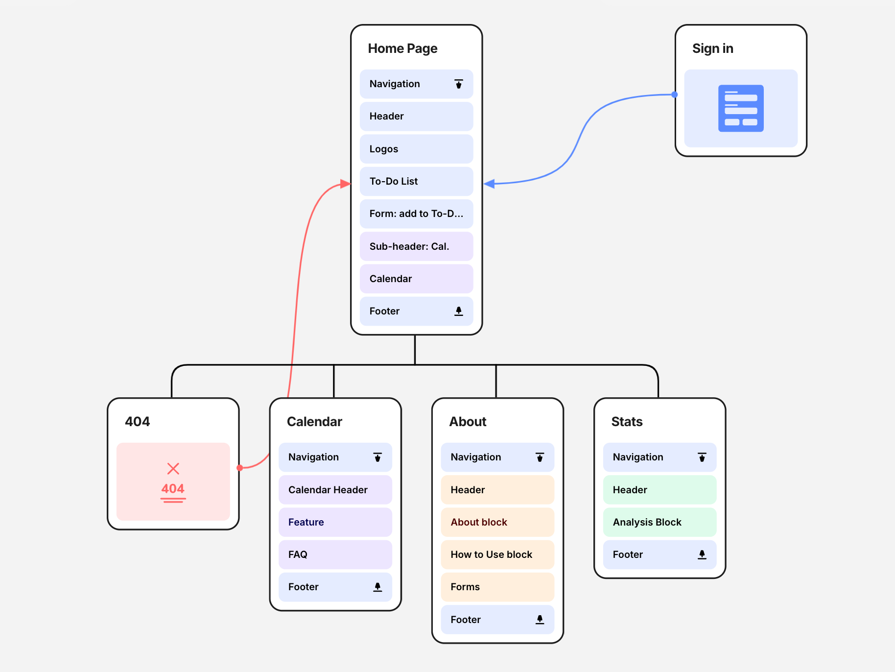
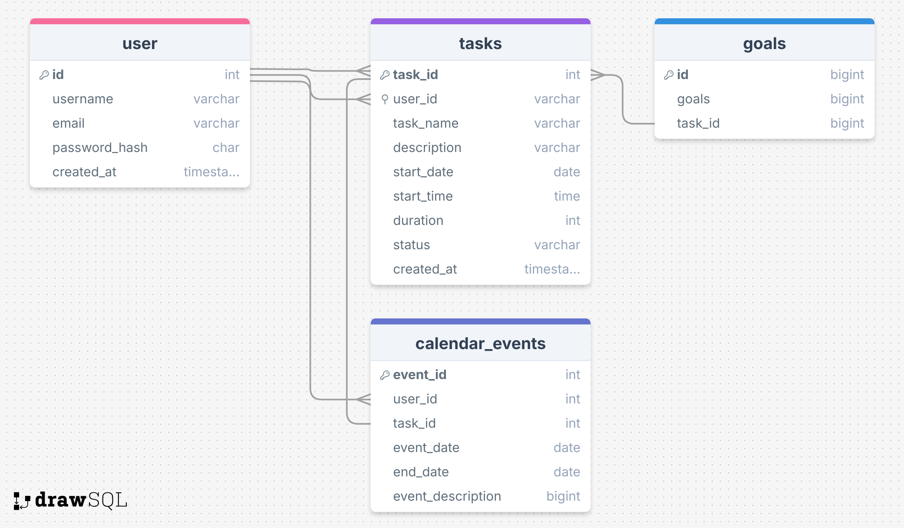

#  MYTE - Sophia Chan Capstone Project
## Table of Contents
1. [Overview](#overview)
    - [Problem Space](#problem-space)
    - [User Profile](#user-profile)
    - [Features](#features)

2. [Implementation](#implementation)
    - [Tech Stack](#tech-stack)
    - [APIs](#apis)
        - [Google Calendar API](#google-calendar-api)
        - [Outlook Calendar API](#outlook-calendar-api)
    - [Sitemap](#sitemap)
    - [Mockups](#mockups)
    - [Data](#data)
    - [Endpoints](#endpoints)
3. [Roadmap](#roadmap)
4. [Future Implementations](#future-implementations)

## Overview
MYTE is a task management app that combines time planning with your to-do list. MYTE stands for manage your time effectively. Unlike regular to-do lists, MYTE allows you to assign time estimates for tasks and seamlessly adds them to your calendar. The app emphasizes the importance of the process over the outcome, highlighting that every step is part of the journey.


### Problem Space
Have you ever struggled with balancing to-do lists and calendars?

Regular apps either focus on lists without accounting for the time required to complete tasks or on calendars without flexibility of task management.
- When you make a to-do list there is either an extra step to go from the to-do list to the calendar.
- Or if you only use calendar without to-do list, this does not account for completion of task.
- Example of others having this [problem](https://answers.microsoft.com/en-us/msoffice/forum/all/how-can-i-integrate-the-to-do-tasks-into-the/9ba1819a-40e6-42da-9805-8f99a3cb0deb)

MYTE addresses this by helping users organize tasks wihtin the context of their busy schedules, avoiding task overload while accounting for both meetings and personal tasks.

### User Profile

MYTE is for:
- A user that wants to make a to-do lists but have it accessible from any device connected to the internet.
- A user who juggles multiple responsibilities and needs help managing time-based tasks at work.
    - **special consideration** would be needed for extra security as large companies may not want a 3rd party app accessing their calendar data.
- A user who needs help balancing school work, assignments, extracurriculars, and study time.
- A user who needs to coordinate family activities, personal tasks, and work commitments.
- A neurodiverse user who needs flexible scheduling, better task organization, and customization.

### Features

- As a user, I want to be able to add tasks to my to-do list
- As a user, I want to be able to edit any task in my to-do list
- As a user, I want to be able to read all my current tasks in my to-do list
- As a user, I want to be able to delete a tasks in my to-do list.

- As a user, I want to be able to see scheduled tasks in a daily, weekly, or monthly calendar view

## Implementation
1. Basic components
    - Routes
    - tailwind understanding and implementation

2. Create Database
    - login/users (for future implemenetation)
    - Goal (for future implementation)
    - To Do List (MVP: id, user_id, task_name, start date, duration, end date, status )
    - Calendar database (not too sure if the API can be called and no data needs to be saved or if we need to save calendar events?)

3. Import Calendar APIs
    - Google Calendar (MVP)

4. Create Express Server to save, read, delete to do list


### Tech Stack

- <a href="https://reactjs.org/" target="_blank" rel="noreferrer">  </a>
- <a href="https://expressjs.com" target="_blank" rel="noreferrer"> express  </a>
- <a href="https://www.mysql.com/" target="_blank" rel="noreferrer">  </a>
- Client libraries used are:
    - [react-router-dom](https://www.npmjs.com/package/react-router-dom) which uses [react-router](https://www.npmjs.com/package/react-router)
    - [axios](https://www.npmjs.com/package/axios
    )
    - [react-google-calendar](https://www.npmjs.com/package/react-google-calendar-api)
    - [react-week-calendar](https://www.npmjs.com/package/react-week-calendar)
    - [react-calendar](https://www.npmjs.com/package/react-calendar)
    - tailwindscss <a href="https://tailwindcss.com/" target="_blank" rel="noreferrer">  </a>

- servers libraries
    - [knex](https://www.npmjs.com/package/knex)
    - node.js<a href="https://nodejs.org" target="_blank" rel="noreferrer">  </a>
    - Future Implementation: [bycrypt for password hashing](https://www.npmjs.com/package/bookshelf-bcryptjs)

- Google Calendar API
- Outlook Calendar API

- Limitations for Calendar APIs
    - Both are limited by rate limits
    - authenitication may be complex with tokens required
    - sync issues
    - real-time updates could be difficult

### APIs

#### Google Calendar API
| End Point   | Description              |
| :-------- | :------------------------- |
|GET| Returns a users calendar event data.|

### Sitemap



- Home page displays the to-do list component and the user's calendar.
    - to-do list component includes the user's task list with options to click to edit delete or mark complete.
- Calendar page shows the calendar day/week/month view to schedule tasks
- (Future Implementation) Stats page is part of the future implementation which will include completed tasks, larger goals and the journey diagram to see where tasks are in comparison to large goals and projects
- (Future Implementation) About page includes information for the user how to use MYTE, information tips about how to be more productive and the idea about MYTE.

### Mockups
The site will be built using a mobile first approach:

| Mobile Home Page  | Mobile Calendar Page      |
| :--------  | :-------- |
|  |   | |

Then desktop will be designed:

| Tablet/Desktop Home Page  | Tablet/Desktop Calendar Page  |
| :--------  | :--------  |
|  |  |

### Data


### Endpoints
List endpoints that your server will implement, including HTTP methods, parameters, and example responses.
#### Get all tasks

```http
  GET /tasks
```

| Parameter | Type | Description    |
| :--------  | :-------- |  :------------------------ |
| `/tasks` | `return` |  This endpoint returns an array of objects |

#### Adds a new task

```http
  POST /tasks
```

| Parameter | Type | Description    |
| :--------  | :-------- |  :------------------------ |
| `tasks ` | `object` | This end point adds a new task. |

#### Edits a task

```http
  PUT /tasks/:id
```

| Parameter | Type | Description    |
| :--------  | :-------- |  :------------------------ |
| `taskId` | `number` |  **Required** Id of a task is needed to edit a task |

#### Removes a task from the task list

```http
  DELETE /tasks/:taskId
```

| Parameter | Type | Description    |
| :--------  | :-------- |  :------------------------ |
| `taskId` | `number` |  **Required** Id of a task is needed to delete a task |

#### Get all lists

```http
  GET /lists
```

| Parameter | Type | Description    |
| :--------  | :-------- |  :------------------------ |
| `/lists` | `return` |  This endpoint returns an array of objects |

#### Adds a new list

```http
  POST /lists
```

| Parameter | Type | Description    |
| :--------  | :-------- |  :------------------------ |
| `lists ` | `object` | This end point adds a new task. |

#### Edits a list

```http
  PUT /lists/:listId
```

| Parameter | Type | Description    |
| :--------  | :-------- |  :------------------------ |
| `listId` | `number` |  **Required** Id of a task is needed to edit a task |

#### Removes a task from the task list

```http
  DELETE /lists/:listId
```

| Parameter | Type | Description    |
| :--------  | :-------- |  :------------------------ |
| `id` | `number` |  **Required** Id of a task is needed to delete a task |
## Roadmap
### Milestone 1: create a minimum viable product
- MVP = where a user can add a task, edit a task, delete task, and view this from a list and a calendar.

    - Day 1 (Sept 10): Set-up Front-End & Back-End apps
    - Day 2 (Sept 11): Import Calendar API, Set up Database & Back-End
    - Day 3 - 5 (Sept 12-14): Develop core to-do list features
    - Day 6 + 7 (Sept 15 + 16): Calendar feature
    - Day 8 (Sept 17): testing & About page
    - Day 9 (Sept 18): Add personalization feature
    - Day 10 (Sept 19): further testing & refine UI
    - Day 11 (Sept 20): Fix bugs & testing again
    - Day 12 (Sept 21): Update README File for Back-End & Front-End
- ### Day 13 (Sept 22) **DEADLINE**: Scheduling cushion for last minute bug fixes

---

## Future Implementations

- Goals/ sub items/bigger goal relationships so that this can be used to visualize the journey to completing goals/large tasks
- Current Weather feature displayed on calendar
- Pomodoro timer page
- Sorting Page
    - Based on Eisenhower Matrix (Urgent/Important, Not Urgent/important, Urgent/Unimportant, Not Urgent/Unimportant)
    - Or tasks can be sorted by categories. Will need to add Categories to the to do list component and database
- Accessibility toggle add-ons:
    - Customize colors to user preference
    - Blindness read out loud feature
    - Visually impaired
    - motor skill disorders
    - colour blindness
    - Epilepsy
    - ADHD
    - Learning
    - Elder

- AI-assisted rescheduling
    - Utilize AI to help reschedule tasks to the next open slot - would need to shift all other tasks
-  Energy Tracker
    - Understanding your energy levels during the day and with tasks helps improve efficency. When you feel more energized you are more able to complete more tasks and more difficult tasks.  Knowing what time of day you have more/less energy can help you better manage your time and tasks.
- Stats page
    -  Provide suggestions on duration based on past feedback about how long tasks have taken to complete.
    - Eventually this could be used by employers to better understand where bottlenecks are or where their employees are getting bogged down (such as meetings)

- Filter feature to filter only tasks for a day, week, month, or category
- Nodemailer for email notifications of daily task summaries
- OpenAI API for future AI scheduling

| End Point   | Description              |
| :--------   | :------------------------- |
|coming soon  | this end point is for getting the calendar events of a user|

### Features
- As a user, I want to be able to see completed tasks
- As a user, I want to be able to read about how to use the to-do list
- As a user, I want to be able to customize my to-do list to make it my own based on my preferences and needs
- As a user, I want to be able to better manage my tasks utilizing data analysis of when I am productive based on energy levels and how long tasks are taking.
- As a user, I want to be able to receive notifications for tasks or summary of important tasks.
- As a user, I want to be able to prioritize tasks.
- As a user, I want to be able to marks tasks "in progress" or "completed" to better track my progress
- As a user, I want to be able to set recurring tasks for daily, weekly, or monthly schedules.
- As a user, I want to be able to collaborate on larger projects and tasks.

## Roadmap

### Milestone 2: Add Sign-In & accessibility features
- allows the user to customize their to-do list

### Milestone 3: Add larger goal/projects to get completed percent view/projection
- completing one tasks of a larger goal/project will show the percentage completed of the larger goal.

### Milestone 4: Add AI integration
- integrate AI model to help users move tasks if they are invited to meeting or task is taking longer
- smart complete for tasks in a project, this might be allowing the user to create re-usable work flows that remember the tasks in a project so that when a user creates the same project again it knows what tasks are needed and dependent on each other.

### Milestone 5: integrate data analysis
- Research appropriate types of analysis that could be used such as a python library?
- suggested durations based on tasks name

### Milestone 6: add additional widgets
- current time in calendar app
- task management resources such as Pomodor timer, sort page
- email notifications

### Milestone 7: Collaboration
- implement a feature to allow users to collaborate across different users the tasks
